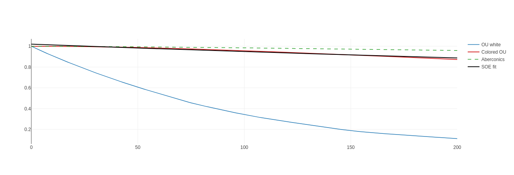

# Julia Code: Examples & GFE Module

This repository contains the Julia reference implementation of the **Aberconics framework** and its **GFE (Geometric Fourier Extension) engine** for stabilized non-Markovian memory kernels.

## About This Repository

- Focus: explicit memory kernels (SOE), interpretable spectral metrics, and adaptive dynamical modeling.
- Core implementation: `code/julia/src/GFE.jl` with runnable experiments in `code/julia/examples/`.
- Outputs: interactive results under `results/` (OU noise, Lorenz, Gray-Scott).

## Visuals




## 📦 Directory Structure

```
code/julia/
├── Project.toml          # Dependency manifest (Julia 1.12+)
├── Manifest.toml         # Exact dependency versions
├── src/
│   └── GFE.jl            # Spectral kernel engine (core library)
├── examples/
│   ├── 01_ou_noise_demo.jl
│   ├── 02_lorenz_chaos_suppression.jl
│   ├── 03_gray_scott_patterns.jl
│   └── 04_echo_task_learning.jl
└── README.md             # This file
```

## 🚀 Quick Start

### 1. Install & Activate Environment

```bash
cd code/julia
julia
julia> ] activate .
julia> ] instantiate    # Download exact dependency versions
```

### 2. Run an Example

**Experiment 1: Colored Noise Kernel Validation (~35 seconds)**
```julia
include("examples/01_ou_noise_demo.jl")
```

**Experiment 2: Lorenz Chaos Suppression (~130 seconds, 4 threads)**
```bash
julia -t 4
```
```julia
include("examples/02_lorenz_chaos_suppression.jl")
```

**Experiment 3: Gray-Scott Pattern Formation (~variable)**
```julia
include("examples/03_gray_scott_patterns.jl")
```

**Experiment 4: Echo Task Learning**
```julia
include("examples/04_echo_task_learning.jl")
```

## 📖 GFE Module Reference

The **GFE.jl** module provides the spectral machinery for kernel approximation and fitting.

### Core Functions

#### 1. **Exponential Basis Creation**

```julia
include("src/GFE.jl")
using .GFE

# Define decay rates (log-spaced)
γ = exp10.(range(-2, stop=1, length=15))  # 15 basis functions

# Time grid
t = 0:0.1:50

# Create design matrix
Φ = design_matrix(γ, t)  # shape: (501, 15)
```

#### 2. **Kernel Fitting (NNLS)**

```julia
# High-level function for kernel fitting
γ_fit, w_fit, fit = fit_soe_kernel(
    t_acf,           # Time grid of ACF
    acf_data,        # Autocorrelation function to fit
    n_basis=15,      # Basis functions
    γ_min=1e-2,      # Minimum decay rate
    γ_max=10,        # Maximum decay rate
    threshold=0.01   # Pruning threshold
)

println("Fitted \$(length(γ_fit)) out of 15 basis functions")
println("L1 fit error: \$(norm(fit - acf_data, 1) / length(acf_data))")
```

**Lower-level access (custom NNLS):**
```julia
A = design_matrix(γ, t)
w = nnls_pg(A, data, lr=1e-3, iters=4000)
```

#### 3. **Memory Metrics**

```julia
# Compute comprehensive spectral units
su = spectral_units(w_fit, γ_fit)

println("Mean memory capacity (seconds): \$(su.Mcap)")
println("Spectral span (log₁₀): \$(su.Mscale)")
println("Memory resolution (modes/decade): \$(su.Mres)")
println("Memory entropy (nats): \$(su.Hmem)")
println("Normalized entropy: \$(su.Hnorm)")
println("Effective rank/dimension: \$(su.Deff)")
```

**Shorthand functions:**
```julia
cap = memory_capacity(w, γ)      # Σ wᵢ/γᵢ
ent = spectral_entropy(w)        # Hmem / log(n)
d_eff = effective_dimension(w)   # e^Hmem
```

#### 4. **Parameter Packing/Unpacking** (For Optimization)

Used when optimizing memory parameters (γ, w).

```julia
# Pack: (γ, w) → θ (unconstrained)
θ = pack_memory_params(γs, ws)

# Optimize θ with Optim.jl or similar
# ...

# Unpack: θ → (γ, w)
γ_opt, w_opt = unpack_memory_params(θ_result)
```

**Key property**: Packing enforces:
- γ: Sorted descending (γ₁ ≥ γ₂ ≥ ... ≥ γₙ)
- w: Positive weights

#### 5. **Convenience: Memory Channel Initialization**

```julia
# Create L memory channels with default configuration
γs, ws = GFE.create_memory_channels(3)
# Returns: γ ≈ [1.0, 0.1, 0.01], w ≈ [0.333, 0.333, 0.333]

# Custom initialization
γs, ws = GFE.create_memory_channels(
    5,
    γ_range = (0.001, 10.0),
    w_init = [0.2, 0.2, 0.2, 0.2, 0.2]
)
```

## 🔬 Example Workflow: Fit Kernel to Data

```julia
include("src/GFE.jl")
using .GFE
using DifferentialEquations, Statistics

# 1. Generate colored noise (example)
function colored_ou!(du, u, p, t)
    θ, α = p
    du[1] = -θ * u[1] + u[2]
    du[2] = -α * u[2] + sqrt(2*θ) * randn()
end

prob = ODEProblem(colored_ou!, [1.0, 0.0], (0.0, 500.0), (1.0, 0.1))
sol = solve(prob, Tsit5(), saveat=0.1)

# 2. Compute ACF
data = [u[1] for u in sol.u]
acf_data = [cor(data, lag) for lag in 0:200]
t_acf = (0:200) * 0.1

# 3. Fit kernel
γ_fit, w_fit, acf_fit = fit_soe_kernel(
    t_acf, acf_data,
    n_basis=20,
    threshold=0.01
)

# 4. Evaluate quality
su = spectral_units(w_fit, γ_fit)
l1_error = norm(acf_fit - acf_data, 1) / length(acf_data)

println("✓ Fitted \$(length(w_fit)) modes")
println("  Memory capacity: \$(round(su.Mcap, digits=2)) seconds")
println("  L1 error: \$(round(l1_error, digits=5))")
println("  Effective dimension: \$(round(su.Deff, digits=2))")
```

## 📚 API Summary

### Exports from GFE Module

| Function | Purpose |
|----------|---------|
| `exponential_basis(γ, t)` | Create basis functions [exp(-γᵢ t)] |
| `design_matrix(γ, t)` | Alias for exponential_basis |
| `nnls_pg(A, b; ...)` | Solve non-negative least squares |
| `fit_soe_kernel(t, data; ...)` | High-level kernel fitting |
| `spectral_units(w, γ)` | Compute all memory metrics |
| `memory_capacity(w, γ)` | Mean timescale Σ wᵢ/γᵢ |
| `spectral_entropy(w)` | Normalized entropy |
| `effective_dimension(w)` | Effective rank e^H |
| `pack_memory_params(γ, w)` | Convert to optimization variables |
| `unpack_memory_params(θ)` | Recover parameters from optimization |
| `validate_decay_ordering(γ)` | Check γ is sorted descending |
| `create_memory_channels(L; ...)` | Initialize L memory channels |

### Exports from GFE Module (Types)

| Type | Purpose |
|------|---------|
| `SpectralUnits` | Container for memory metrics (Mcap, Mscale, Mres, Hmem, Hnorm, Deff) |

## 🎯 Use Cases

### Use Case 1: Fit Experimental Data to SOE Kernel

```julia
# Load your ACF/correlation data
acf_experimental = load_data("my_acf.csv")
t_vals = 0:0.01:100

# Fit
γ_fit, w_fit, _ = fit_soe_kernel(t_vals, acf_experimental, n_basis=20)

# Verify fit quality
su = spectral_units(w_fit, γ_fit)
@assert su.Deff > 2  # At least 2 effective modes needed
```

### Use Case 2: Optimize Memory Parameters for Control

```julia
# Pack initial guess
θ0 = pack_memory_params(γ_initial, w_initial)

# Optimize with Optim.jl (maximize chaos suppression)
using Optim
loss(θ) = lyapunov_exponent(unpack_memory_params(θ)...)
result = minimize(loss, θ0, BFGS())

# Recover optimized parameters
γ_opt, w_opt = unpack_memory_params(result.minimizer)
```

### Use Case 3: Analyze Memory Structure

```julia
# Compare two kernels
γ1, w1 = kernel_1()
γ2, w2 = kernel_2()

su1 = spectral_units(w1, γ1)
su2 = spectral_units(w2, γ2)

println("Kernel 1: capacity=$(su1.Mcap), entropy=$(su1.Hnorm)")
println("Kernel 2: capacity=$(su2.Mcap), entropy=$(su2.Hnorm)")
```

## ⚡ Performance Tips

**Threading with Julia:**
```bash
# Run with 4 threads for faster parallel optimization
julia -t 4 examples/02_lorenz_chaos_suppression.jl
```

**Number of basis functions:**
- Fewer bases (n=10): Faster fitting, coarser approximation
- More bases (n=30): Better fit, more computational cost
- Typical: n=15 provides good balance

**NNLS convergence:**
- `iters=4000`: Default, usually sufficient
- `lr=1e-3`: Default learning rate
- For faster convergence: Try `lr=5e-3` (but may be less stable)

## 🐛 Debugging

**Check that decay rates are sorted:**
```julia
@assert issorted(γ, rev=true)  # Should be true after unpack
```

**Verify weights are positive:**
```julia
@assert all(w .> 0)
```

**Monitor fitting convergence:**
```julia
A = design_matrix(γ, t)
w = nnls_pg(A, b, lr=1e-3, iters=4000)
# Check after each 1000 iters for convergence pattern
```

## 🔗 References

- [Aberconics V2.0](https://github.com/pilloverx/aberconics-framework/raw/main/papers/Aberconics_V2.0.pdf)
- [GFE Theoretical Foundations](https://github.com/pilloverx/aberconics-framework/raw/main/papers/GFE_Theoretical_Foundations.pdf)
- [Stabilizing Memory Kernels Supplement](https://github.com/pilloverx/aberconics-framework/raw/main/papers/Stabilizing_Memory_Kernels_Supplement_Feb2026.pdf)

## ✅ Testing

To verify module imports correctly in this repo layout:
```julia
include("src/GFE.jl")
using .GFE

γ, w = GFE.create_memory_channels(3)
su = GFE.spectral_units(w, γ)
println("✓ GFE module working correctly")
```

## How to Cite

If you use this work, please cite:  
Ahorlu, D. K. (2026). *Aberconics: Stabilized Memory Kernels for Non-Markovian Dynamics*. Draft.

## License

This project is licensed under the MIT License. See [LICENSE](LICENSE).

---

**Last Updated**: February 18, 2026  
**Julia Version**: 1.12+  
**Status**: Production-ready with examples
