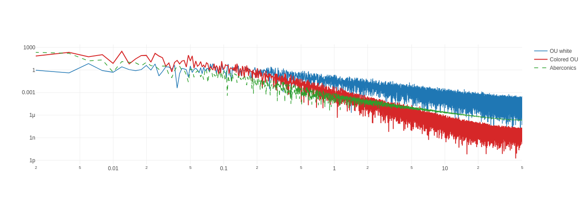

Physics-grounded memory-kernel tooling and runtime infrastructure for Aberconics / HierAberConic-D2C experiments.

This repository currently contains:
- a reusable C++ `gfe_core` library with tests, CLI tools, and an installable package
- `abersoe` single-level augmented-memory runtime components
- `hierarchical_min` multi-level hierarchy, diagnostics, and renormalization utilities
- a C ABI over the core runtime surface
- thin Python `ctypes` and Julia `ccall` wrappers
- reference experiments and generated result artifacts

## What Is Here

### Core areas
- `code/c++ core`
  - primary implementation surface
  - C++ library, apps, tests, and C ABI
- `code/python`
  - typed `ctypes` wrapper over `gfe_c_api.h`
  - wrapper tests and smoke script
- `code/julia`
  - Julia reference module plus C ABI smoke integration
- `results`
  - generated experiment outputs for OU noise and Lorenz runs
- `docs`
  - theory notes and figures

### Implemented runtime surfaces
- SOE kernel fitting with backend selection
- ABERSOE single-level scenario execution
- hierarchy scenario execution
- hierarchy cross-level diagnostics
- hierarchy renormalization reports
- constrained custom chain-style hierarchy assembly through the C ABI and Python wrapper

### Important references
- Top-level technical reference extract: [D2C.md](D2C.md)
- Source PDF: `HierAberConic_D2C_Technical_Reference_v1.0.pdf`
- C++ details: [`code/c++ core/README.md`](code/c++%20core/README.md)
- Python wrapper details: [`code/python/README.md`](code/python/README.md)
- Julia details: [`code/julia/README.md`](code/julia/README.md)

## Current Status

The repo is no longer just a kernel-fitting prototype.

The current foundation includes:
- compiled `gfe_core` with `abersoe`, `hierarchical_min`, diagnostics, renorm, and C API
- shared-library builds for Python/Julia wrapper use
- canonical runtime scenarios for single-level and hierarchical runs
- typed ABI access to hierarchy reports and constrained custom chain specs
- passing C++ and Python smoke/regression-style tests in the local tree

What is not yet fully implemented from the D2C technical reference:
- predictive-coding training heads
- per-channel value critics / TD learning runtime
- full Python-side Director / TraceStore training orchestration
- discrete-to-continuous token bridge for language-style experiments

So the repo is ready for:
- runtime experimentation
- diagnostics/reporting workflows
- Python module development on top of the current ABI

It is not yet a complete end-to-end D2C training system.

## Quick Start

### 1. Build the C++ core

```bash
cmake -S "code/c++ core" -B "code/c++ core/build" -DCMAKE_BUILD_TYPE=Release
cmake --build "code/c++ core/build" -j
```

### 2. Build the shared library for wrappers

```bash
cmake -S "code/c++ core" -B "code/c++ core/build-shared" -DBUILD_SHARED_LIBS=ON
cmake --build "code/c++ core/build-shared" -j
```

### 3. Run core tests

```bash
ctest --test-dir "code/c++ core/build" --output-on-failure
```

### 4. Run the Python wrapper smoke/test path

```bash
export GFE_CORE_LIB="$(pwd)/code/c++ core/build-shared/libgfe_core.so"
python3 code/python/ctypes_smoke.py
pytest -q code/python/tests
```

### 5. Run the Julia C ABI smoke path

```bash
export GFE_CORE_LIB="$(pwd)/code/c++ core/build-shared/libgfe_core.so"
julia code/julia/examples/05_capi_ccall_smoke.jl
```

## Repo Map

```text
.
├── code/
│   ├── c++ core/      # Main library, CLI tools, tests, C ABI
│   ├── python/        # ctypes wrapper and tests
│   └── julia/         # Julia module and ccall wrapper
├── docs/              # Theory notes and figures
├── results/           # Generated experiment outputs
├── D2C.md             # Markdown extract of the technical reference PDF
└── Context.md         # Project context and implementation notes
```

## Recommended Entry Points

If you are new to the repo:
- read this file first
- then read [`code/python/README.md`](code/python/README.md) for the cleanest wrapper overview
- then read [`code/c++ core/README.md`](code/c++%20core/README.md) for detailed runtime and CLI surfaces

If you want to work from Python:
- start with `code/python/gfe_ctypes.py`
- run `code/python/tests/test_gfe_ctypes.py`

If you want to work from the core:
- start with `code/c++ core/include/gfe/gfe_c_api.h`
- then `code/c++ core/include/abersoe/` and `code/c++ core/src/`

## Visuals



